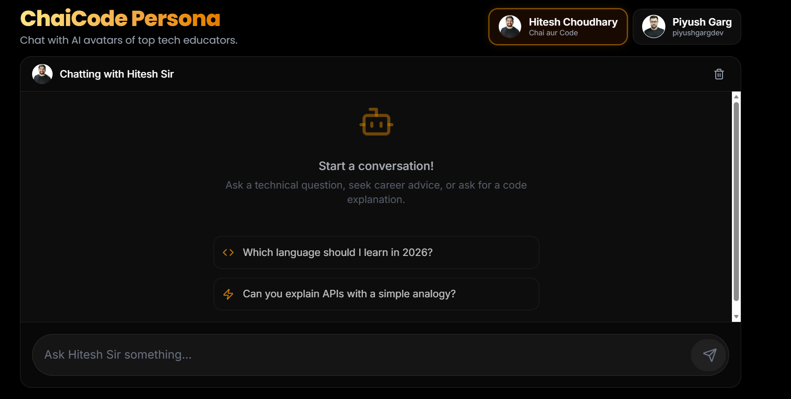
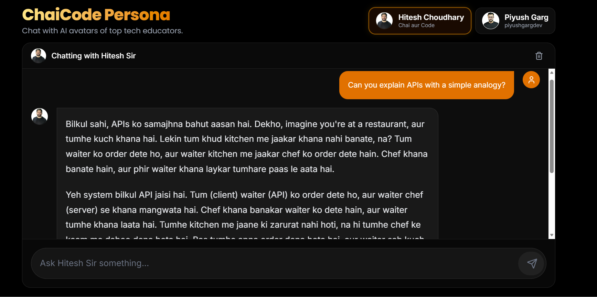
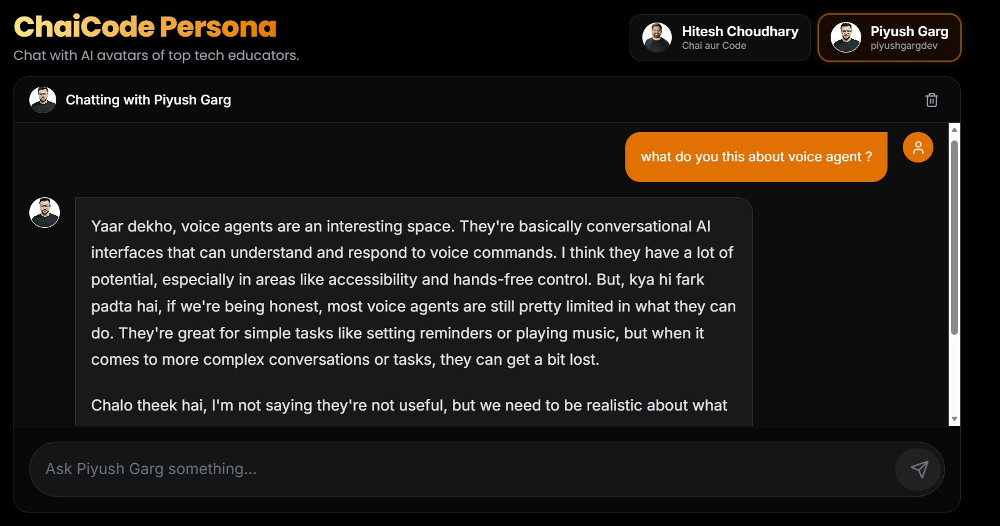

<div align="center">
  
  
  <h1>ChaiCode Persona</h1>
  <p><strong>Chat with AI avatars of top tech educators.</strong></p>
  
  [](https://chaicode-persona.ashaaf.in/)
  [](https://nextjs.org/)
  [](https://groq.com/)
</div>

---

## Overview

**ChaiCode Persona** is an open-source, AI-powered chat application designed to simulate the teaching styles, personalities, and voices of top Indian tech educators. Rather than getting a generic robotic answer, learners can ask technical questions and receive guidance that feels authentic, localized, and highly personal.

Currently, the application features two distinct personas:
1. **Hitesh Choudhary** 
2. **Piyush Garg** 

*Disclaimer: This is an AI trained on public teaching styles for educational demonstration purposes. It is not affiliated with or endorsed by the real individuals.*

---

## The Personas

We didn't just tell the AI to "act like" these educators. We built deep **voice fingerprints** using extensive data collection from their YouTube videos, extracting their favorite analogies, linguistic patterns, pacing, and boundaries.

### Hitesh Sir
Warm, encouraging, and deeply grounded in fundamentals. He often uses real-world analogies (like making chai) to explain complex topics and responds warmly to both Hindi and English.



### Piyush Garg
Direct, engineering-focused, and highly structured. He doesn't sugarcoat things. If an approach is bad, he'll tell you why, focusing on architecture, system design, and production-ready code.



---

## Our Approach & Architecture

Building a persona isn't just about a good prompt; it's about architecture, prompt composition, and state management.

### 1. System Prompt Composition
Instead of one massive, brittle prompt, we split our system prompts into modular components (`src/lib/promptBuilder.ts`):
- **Shared Guardrails**: Rules that apply to *all* personas (e.g., no code execution, no malicious scripts, maintaining AI safety boundaries).
- **Persona Fingerprint**: Unique files (`hitesh.system.md`, `piyush.system.md`) containing language-matching rules, response-length guidelines, vocabulary lists, and conversational shapes.

### 2. Fast Inference with Groq + Llama 3
To make the chat feel real and conversational, latency is critical. We use **Groq's LPU** infrastructure running **Llama-3.3-70B-Versatile**. This allows for near-instant streaming responses, making the AI feel incredibly responsive.

### 3. Stateless, Vercel-Ready Memory
Serverless deployments (like Vercel) suffer from cold starts and memory resets. To solve this, we implemented a **Client-Side Context Architecture**:
- All conversation history is saved directly to the user's browser via `localStorage`.
- When the user sends a message, the client dynamically packages the last ~10-12 messages and sends them to the API route.
- **The Result**: The backend is 100% stateless, infinitely scalable, and your chats survive page refreshes and server restarts!

### 4. Beautiful, Immersive UI
Built with standard **React + Tailwind CSS** (no heavy component libraries), the UI features glassmorphism, smooth micro-animations, layout transitions, and a dark, modern aesthetic that feels premium.

---

## Getting Started (Local Development)

Want to run it yourself or add your own favorite educator? 

### Prerequisites
You will need a free API key from [Groq Console](https://console.groq.com/).

### Installation

1. **Clone the repository:**
   ```bash
   git clone https://github.com/your-username/chaicode-persona.git
   cd chaicode-persona
   ```

2. **Install dependencies:**
   ```bash
   npm install
   ```

3. **Set up environment variables:**
   Create a `.env.local` file in the root directory:
   ```env
   GROQ_API_KEY=your_groq_api_key_here
   GROQ_MODEL=llama-3.3-70b-versatile
   ```

4. **Run the development server:**
   ```bash
   npm run dev
   ```

5. **Open the app:**
   Navigate to [http://localhost:3000](http://localhost:3000) in your browser.

---

## 🛠️ Adding a New Persona

Adding a new persona is incredibly easy:
1. Create a new markdown file in the `personas/` directory (e.g., `harkirat.system.md`).
2. Add their voice fingerprint, catchphrases, and teaching philosophy.
3. Add their avatar to the `public/` folder.
4. Add them to the Persona switcher in `src/app/page.tsx`.

---

<div align="center">
  <p>Built with ❤️ for the Dev Community.</p>
</div>
